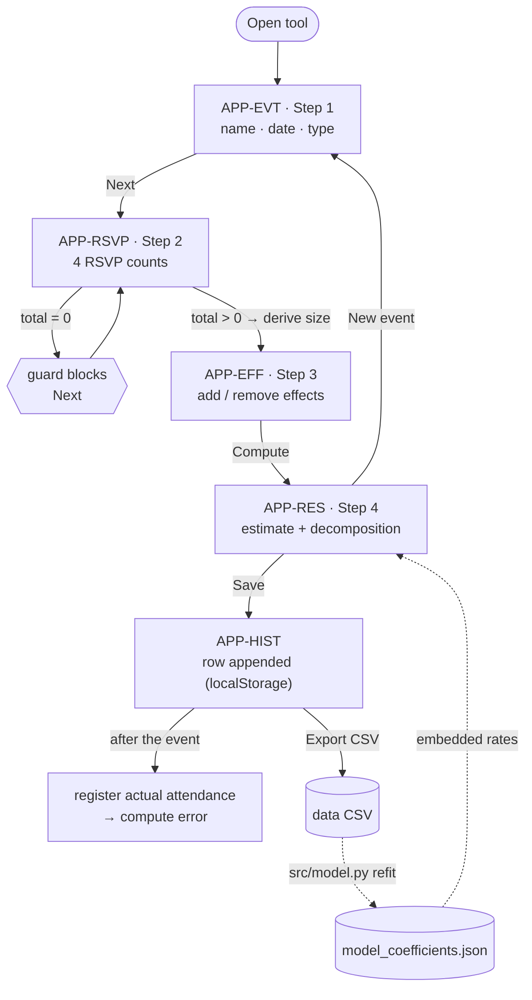
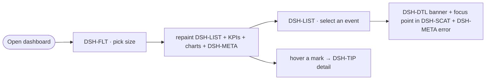

# Component matrices

Four cross-referenced views of the application's UI, for tracking bugs, fixes,
test cases and risk. Same method as the Recife impact model (Modules / Impact /
Reuse) plus an identification view for test selectors.

All four matrices reference one shared **vocabulary** (screens and components
below), so a change to a component can be traced to every screen it touches and
every dependency it carries.

Scope: the two static pages — the estimation tool [`app/index.html`](../app/index.html)
(single-page vertical form, 4 sections) and the dashboard [`reports/index.html`](../reports/index.html)
(F2 three-pane: event list · charts · metrics rail). Kept in sync by hand;
re-verify against the DOM when either page changes (`scripts/check_matrices.py`).

---

## Vocabulary

### Screens (modules)

| Code | Page | Screen / region |
|---|---|---|
| `APP-NAV` | app | Step indicator (persistent chrome over steps 1–4) |
| `APP-EVT` | app | Step 1 — Event (name, date, type) |
| `APP-RSVP` | app | Step 2 — RSVP counts (+ derived total/size) |
| `APP-EFF` | app | Step 3 — External effects (dynamic list) |
| `APP-RES` | app | Step 4 — Result (estimate, decomposition) |
| `APP-HIST` | app | History table + actions (export/clear) |
| `DSH-FLT` | reports | Size filter chips (left rail) |
| `DSH-LIST` | reports | Event list, grouped by size (left rail) |
| `DSH-DTL` | reports | Selected-event detail banner (center top) |
| `DSH-KPI` | reports | KPI strip (center) |
| `DSH-CONV` | reports | Conversion-by-size chart (center) |
| `DSH-SCAT` | reports | Predicted-vs-actual scatter (center) |
| `DSH-META` | reports | Metrics rail — accuracy meter, error, counts, model (right) |
| `DSH-TIP` | reports | Hover tooltip (shared by both charts) |

### Components (reusable UI primitives)

| Code | Component | Notes |
|---|---|---|
| `C-BTN` | Button (`.btn`) | secondary + `.primary` + `.sm` variants |
| `C-TXT` | Text input | |
| `C-NUM` | Number input | |
| `C-DATE` | Date input | |
| `C-RADIO` | Radio group | |
| `C-CHIP` | Pill / badge | **two divergent instances** — size badge vs filter chip |
| `C-STEP` | Stepper dot + connector | |
| `C-BAR` | Horizontal bar | two impls: div (`APP-RES`) vs SVG (`DSH-CONV`) |
| `C-TABLE` | Data table | app history only (dashboard uses `DSH-LIST`) |
| `C-SVG` | SVG chart canvas | |
| `C-LEGEND` | Chart legend | |
| `C-METER` | Progress meter | accuracy meter (`DSH-META`) |
| `C-TIP` | Tooltip | |
| `C-CARD` | Surface card (`.card`/`.panel`/`.kpi`/`.mcard`) | |

---

## Operation flow

The order operations happen in — the temporal spine that ties the four matrices
together. Each numbered step is a test scenario (screen + components + state +
selector), and every branch/guard is a risk point.

### Tool — end-to-end (with the recalibration loop)



### Dashboard (F2) — filter / select / inspect



### Operation → matrices (test/risk spine)

Each row joins matrix 1 (feature), 2 (state), 3 (components) and 4 (selector).

| # | Operation | Screen | Components | State written → read | Selector root |
|---|---|---|---|---|---|
| 1 | Enter event metadata | `APP-EVT` | C-TXT, C-DATE, C-RADIO | writes `name`/`date`/`type` | `eve-app-evt-*` |
| 2 | Advance to step 2 | `APP-EVT` | C-BTN, C-STEP | — | `eve-app-evt-btn-next` |
| 3 | Enter RSVP counts | `APP-RSVP` | C-NUM ×4 | writes counts → total | `eve-app-rsvp-num-*` |
| 4 | Auto-derive size class | `APP-RSVP` | C-CHIP (badge) | reads counts → writes `size` | `eve-app-rsvp-out-size` |
| 5 | Advance **(guard: total>0)** | `APP-RSVP` | C-BTN | guard | `eve-app-rsvp-btn-next` |
| 6 | Add / remove effects | `APP-EFF` | C-BTN, C-TXT, C-NUM | writes `effects` | `eve-app-eff-*` |
| 7 | Compute | `APP-RES` | C-BTN | reads counts+`size`+`effects` → writes `last` | `eve-app-res-out-estimate` |
| 8 | Review decomposition | `APP-RES` | C-BAR | reads `last` | `eve-app-res-decomp` |
| 9 | Save to history | `APP-HIST` | C-BTN, C-TABLE | writes `localStorage` | `eve-app-res-btn-save` |
| 10 | Register actual attendance | `APP-HIST` | C-NUM, C-TABLE | writes actual → computes error | `eve-app-hist-num-real` |
| 11 | Export CSV | `APP-HIST` | C-BTN | reads `localStorage` → CSV | `eve-app-hist-btn-export` |
| 12 | Refit (offline) | `src/model.py` | — | CSV → coefficients → both pages | — |
| 13 | Filter dashboard | `DSH-FLT` | C-CHIP | writes filter → repaint all panes | `eve-rpt-flt-chip-*` |
| 14 | Select an event | `DSH-LIST` | C-CARD | writes selection → DSH-DTL + scatter focus + DSH-META | `eve-rpt-list-row` |
| 15 | Inspect a data point | `DSH-CONV`/`DSH-SCAT` | C-SVG, C-TIP | reads embedded data | `eve-rpt-tip` |

**Branch / risk points** (each needs its own test):
- **Mandatory gating** — Next is disabled until step 1 name is filled and step 2
  total > 0; the single-page form shows all sections, Next scrolls to the next.
- **New event** resets all inputs — verify no state leaks into the next event.
- **Filter + selection interaction** — a filter that hides the selected event must
  clear the selection (steps 13–14).
- **Save → export → refit → embed** is the cross-boundary loop (steps 9→12);
  the coefficient JSON is the shared contract (see matrix 2).

---

## 1 · Module ↔ feature matrix

Which functionality each screen provides. `●` primary owner · `○` participates.

| Feature | NAV | EVT | RSVP | EFF | RES | HIST | FLT | LIST | DTL | KPI | CONV | SCAT | META | TIP |
|---|:-:|:-:|:-:|:-:|:-:|:-:|:-:|:-:|:-:|:-:|:-:|:-:|:-:|:-:|
| Step navigation / guard | ● | ○ | ○ | ○ | ○ | | | | | | | | | |
| Enter event metadata | | ● | | | | | | | | | | | | |
| Enter RSVP counts | | | ● | | | | | | | | | | | |
| Derive size class | | | ● | | ○ | | | | | | | | | |
| Manage external effects | | | | ● | | | | | | | | | | |
| Compute estimate | | | | | ● | | | | | | | | | |
| Show estimate decomposition | | | | | ● | | | | | | | | | |
| Save event to history | | | | | ● | ○ | | | | | | | | |
| Register actual attendance | | | | | | ● | | | | | | | | |
| Compute error | | | | | | ● | | ○ | ● | | | | ● | |
| Export CSV | | | | | | ● | | | | | | | | |
| Clear history | | | | | | ● | | | | | | | | |
| Filter by size | | | | | | | ● | ○ | | ○ | ○ | ○ | ○ | |
| Browse / select events | | | | | | | | ● | ○ | | | ○ | ○ | |
| Summary metrics (KPIs) | | | | | | | | | | ● | | | | |
| Conversion visualization | | | | | | | | | | | ● | | | ○ |
| Predicted-vs-actual viz | | | | | | | | | ○ | | | ● | | ○ |
| Accuracy / model metrics | | | | | | | | | | | | | ● | |
| Hover detail | | | | | | | | | | | ○ | ○ | | ● |

---

## 2 · Cross-dependence matrix (UI-level impact)

Reads the state a producer writes → a consumer depends on. A change to the
producer risks breaking every consumer in its row.

| Producer writes | State / artifact | Consumers (read) | Break risk if producer changes |
|---|---|---|---|
| `APP-EVT` | `name`, `date`, `type` | `APP-RES` (`last`), `APP-HIST` (row) | Saved records lose/mislabel metadata |
| `APP-RSVP` | 4 counts | `APP-RSVP` (total/size), `APP-RES` (compute) | Wrong size → wrong rate → wrong estimate |
| `APP-RSVP` | derived `size` | `APP-RES`, `APP-HIST` | Estimate uses wrong rate row |
| `APP-EFF` | effects list | `APP-RES` (multiplier) | Estimate skips/double-applies effects |
| `APP-RES` | `last` (computed event) | `APP-HIST` (Save) | Nothing to save / stale save |
| `APP-HIST` | `localStorage["eve-history-v1"]` | `APP-HIST` (render, export), self | History corruption; schema drift breaks CSV |
| `APP-HIST` | exported `eve-history.csv` | `src/model.py` (refit) → coefficients | **Cross-boundary:** shape change breaks retrain |
| `src/model.py` | `data/model_coefficients.json` | `app` `RATES`, `reports` `ROWS`/`CONV`/`META` | **Cross-page:** refit repaints both pages |
| `DSH-FLT` | active filter | `DSH-LIST`, `DSH-KPI`, `DSH-CONV`, `DSH-SCAT`, `DSH-META` | Pane desync — panels show different sets |
| `DSH-LIST` | selected event | `DSH-DTL`, `DSH-SCAT` (focus), `DSH-META` (error) | Stale/blank detail; selection survives a filter that hid it |

### The recalibration loop (highest-value cross-impact)

```
APP-HIST ──export CSV──▶ data/*.csv ──▶ src/model.py ──▶ model_coefficients.json
   ▲                                                              │
   └──────────── embedded RATES / ROWS / META ◀───────────────────┘
                         (app + reports)
```

The tool's own output is the retrain input, and the retrain output is embedded
in **both** pages. Practical consequence: **the coefficient JSON is a shared
contract** — changing its keys (`micro/small/medium/large` × `confirmed/maybe/
declined/no_reply`) is a breaking change for two consumers at once. Test it as a
contract, not as separate features.

---

## 3 · Component reuse matrix

Where each reusable component appears. A fix or test on a component must cover
every screen with a mark; a divergence between marks is where bugs hide.

| Component | EVT | RSVP | EFF | RES | HIST | FLT | LIST | KPI | CONV | SCAT | META | Reuse notes |
|---|:-:|:-:|:-:|:-:|:-:|:-:|:-:|:-:|:-:|:-:|:-:|---|
| `C-BTN` | ● | ● | ● | ● | ● | ● | | | | | | primary on steps; `.sm` on HIST/EFF; clear-selection on DTL |
| `C-TXT` | ● | | ● | | | | | | | | | name; effect description |
| `C-NUM` | | ● | ● | | ● | | | | | | | 4 counts; effect %; actual attendance |
| `C-DATE` | ● | | | | | | | | | | | |
| `C-RADIO` | ● | | | | | | | | | | | event type |
| `C-CHIP` | | ● | | | | ● | | | | | | ⚠ **two variants** — size badge ≠ filter chip |
| `C-STEP` | ● | ● | ● | ● | | | | | | | | via `APP-NAV` chrome |
| `C-BAR` | | | | ● | | | | | ● | | | ⚠ **two impls** — div (RES) vs SVG (CONV) |
| `C-TABLE` | | | | | ● | | | | | | | app history only |
| `C-SVG` | | | | | | | | | ● | ● | | |
| `C-LEGEND` | | | | | | | | | | ● | | |
| `C-METER` | | | | | | | | | | | ● | accuracy meter |
| `C-TIP` | | | | | | | | | ● | ● | | one `#tip` node shared by both charts |
| `C-CARD` | ● | ● | ● | ● | ● | | ● | ● | ● | ● | ● | surface primitive |

**Risk flags** (divergent reuse — test both sides):
- `C-CHIP` — the size badge (`#size`) and the filter chips (`.chip`) share the
  pill look but not the code. A visual restyle must touch both, or they drift.
- `C-BAR` — decomposition bars are `<div>`; conversion bars are SVG `<path>`. Same
  meaning, two codepaths; a bar-rendering fix won't propagate automatically.
- `C-TABLE` vs `DSH-LIST` — the app history is a `<table>` with inputs; the
  dashboard event list is card rows. Same "rows of events" idea, different
  structure → different test cases.

---

## 4 · Component identification matrix

Selectors for test automation. **Functional `id`s exist today; `data-testid` is a
proposed convention** (not yet in the DOM — see note below).

Convention (mirrors the Recife desktop pattern `pc-<screen>-<region>-<component>`):

```
eve-<page>-<screen>-<component>[-<qualifier>]
     app|rpt   evt|rsvp…    btn|num…    confirmed|save…
```

The functional `id` stays untouched; `data-testid` is added alongside it.

### Tool — `app/index.html`

| Element | role | accessible name | current `id` | proposed `data-testid` |
|---|---|---|---|---|
| Step dots 1–4 | — | "1"–"4" | `dot1`…`dot4` | `eve-app-nav-step-{n}` |
| Name field | textbox | Event name | `name` | `eve-app-evt-txt-name` |
| Date field | textbox (date) | Date | `date` | `eve-app-evt-date` |
| Type radios | radio | Physical / Virtual | `name=type` | `eve-app-evt-radio-type` |
| Next (step 1) | button | Next | `next1` | `eve-app-evt-btn-next` |
| Next (step 2) | button | Next | `next2` | `eve-app-rsvp-btn-next` |
| Compute | button | Compute estimate | `compute` | `eve-app-eff-btn-compute` |
| Count — confirmed | spinbutton | Confirmed | `confirmed` | `eve-app-rsvp-num-confirmed` |
| Count — maybe | spinbutton | Maybe | `maybe` | `eve-app-rsvp-num-maybe` |
| Count — declined | spinbutton | Declined | `declined` | `eve-app-rsvp-num-declined` |
| Count — no reply | spinbutton | No reply | `no_reply` | `eve-app-rsvp-num-no_reply` |
| Total readout | — | Total invited | `total` | `eve-app-rsvp-out-total` |
| Size badge | — | size | `size` | `eve-app-rsvp-out-size` |
| Add effect | button | + add effect | `addEff` | `eve-app-eff-btn-add` |
| Effect row (dynamic) | — | — | `.effect-row` | `eve-app-eff-row` |
| Estimate value | — | — | `resNum` | `eve-app-res-out-estimate` |
| Estimate range | — | — | `resRange` | `eve-app-res-out-range` |
| Decomposition | — | — | `decomp` | `eve-app-res-decomp` |
| New event | button | New event | `newEvent` | `eve-app-res-btn-new` |
| Save | button | Save to history | `save` | `eve-app-res-btn-save` |
| History table | table | — | `histTable` | `eve-app-hist-table` |
| History body | rowgroup | — | `histBody` | `eve-app-hist-body` |
| Actual-attendance input | spinbutton | actual attendance | `[data-reg]` | `eve-app-hist-num-real` |
| Delete row | button | delete | `[data-del]` | `eve-app-hist-btn-del` |
| Export CSV | button | Export CSV | `exportCsv` | `eve-app-hist-btn-export` |
| Clear history | button | Clear history | `clearHist` | `eve-app-hist-btn-clear` |

### Dashboard — `reports/index.html` (F2)

| Element | role | accessible name | current `id` | proposed `data-testid` |
|---|---|---|---|---|
| Filter chips | button (pressed) | All/Micro/… | `.chip[data-f]` | `eve-rpt-flt-chip-{size}` |
| Event count | — | — | `evCount` | `eve-rpt-list-count` |
| Event list | listbox | — | `eventList` | `eve-rpt-list` |
| Event row | option | `{id}` | `.ev[data-id]` | `eve-rpt-list-row` |
| Detail banner | — | — | `detail` | `eve-rpt-dtl` |
| Clear selection | button | Clear | `clearSel` | `eve-rpt-dtl-btn-clear` |
| KPI strip | — | — | `kpis` | `eve-rpt-kpi` |
| Conversion chart | img (svg) | Conversion by size | `chartConv` | `eve-rpt-conv-svg` |
| Scatter chart | img (svg) | Predicted vs actual | `chartScatter` | `eve-rpt-scat-svg` |
| Scatter legend | — | — | `legScatter` | `eve-rpt-scat-legend` |
| Accuracy value | — | — | `accVal` | `eve-rpt-meta-accuracy` |
| Error breakdown | — | — | `errRows` | `eve-rpt-meta-error` |
| Events-by-size | — | — | `sizeRows` | `eve-rpt-meta-sizes` |
| Model card | — | — | `modelSrc` | `eve-rpt-meta-model` |
| Tooltip | tooltip | — | `tip` | `eve-rpt-tip` |

> **Status of testids:** proposed only. The pages currently expose functional
> `id`s and ARIA labels (enough for many selectors), but no `data-testid`. Wiring
> the column above into both pages is a mechanical follow-up — say the word and I
> add them without touching functional ids or behavior.

---

## How to use these together

- **Bug triage:** find the component in matrix 3 → every screen it touches; find
  the screen in matrix 2 → every downstream consumer. That's the blast radius.
- **Test planning:** the operation flow gives the ordered scenarios; matrix 1 the
  feature list per screen; matrix 4 the selectors; matrix 3's risk flags the
  "test both variants" cases.
- **Risk:** the recalibration loop (matrix 2) and the shared coefficient contract
  are the highest-impact edges — prioritize their tests.
