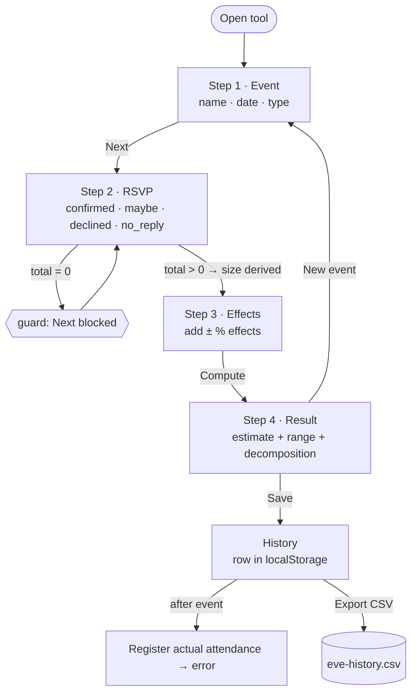
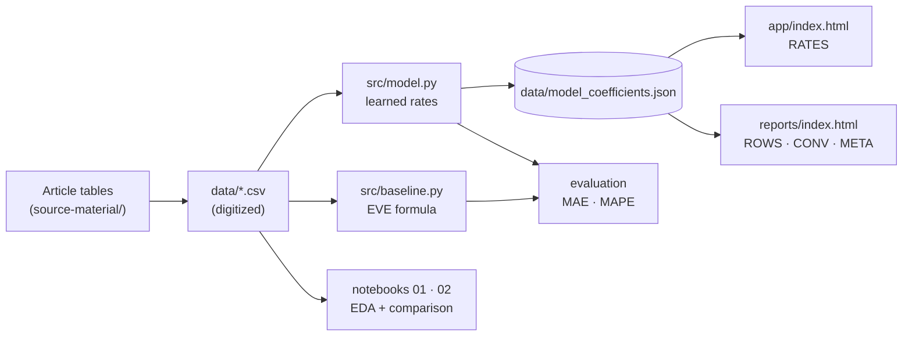
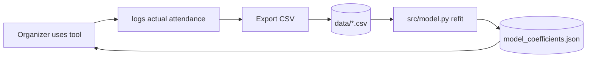
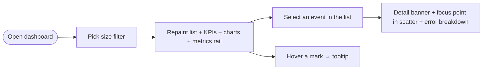

# Flow document

How things move through the system — user actions, data, and the retrain loop.
The per-step spine (operation → screen → component → state → selector) lives in
[`../Skills/COMPONENT-MATRICES.md`](../Skills/COMPONENT-MATRICES.md#operation-flow);
this document is the higher-level picture.

## 1. User flow — estimation tool

Guards and resets are the fragile points: the `total = 0` guard on steps 2–3,
and **New event** clearing all inputs.

## 2. Data flow — analysis pipeline

The CSVs are the single source of truth; `model.py` is the only writer of the
coefficient JSON; the two pages are read-only consumers of it.

## 3. System flow — the recalibration loop

The one cross-boundary cycle, and the highest-value thing to keep intact:

The tool's output (real attendance) becomes the retrain input; the retrain
output (rates) is embedded back into the tool and dashboard. The coefficient
JSON is therefore a **shared contract** — see the cross-dependence matrix.

## 4. Dashboard flow (F2)

Interaction risk: a filter that hides the currently selected event must clear
the selection (otherwise the detail banner goes stale).
