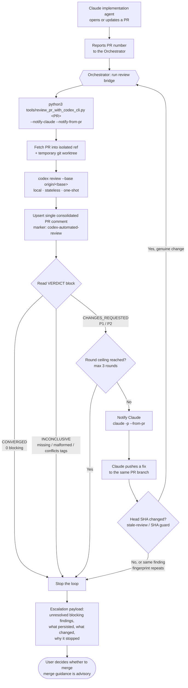
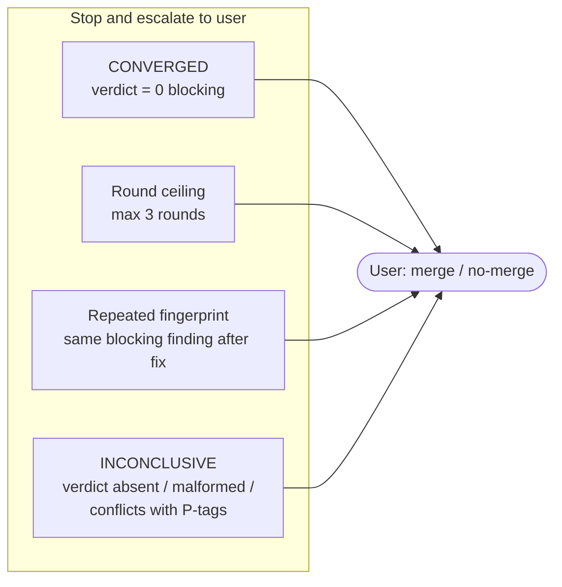
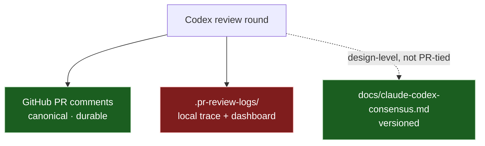

# code-codex-pr-review — how it works

Diagram for the [`code-codex-pr-review`](../Skill/code-codex-pr-review.md)
orchestration. It drives the Claude → Codex pull-request review loop: the
orchestrator owns the queue and handoffs, Codex owns independent review judgment,
and the user owns the final merge decision.

Related: operational flow in [`pr-review-flow.md`](pr-review-flow.md) · design
consensus in [`claude-codex-consensus.md`](claude-codex-consensus.md).

## Review loop

## Stop conditions (safety lock)

The orchestrator stops and escalates to the user when any of these fires. It only
iterates on **P1/P2** (blocking) findings — never on P3 nits.

## Where the contact with Codex is registered

- **GitHub PR comments** — the record of record for PR-tied exchanges. Durable.
- **`docs/claude-codex-consensus.md`** — versioned record of Claude ↔ Codex
  design exchanges not tied to a specific PR.
- **`.pr-review-logs/`** — gitignored; lost when the container is reclaimed. Not a
  durable history.
