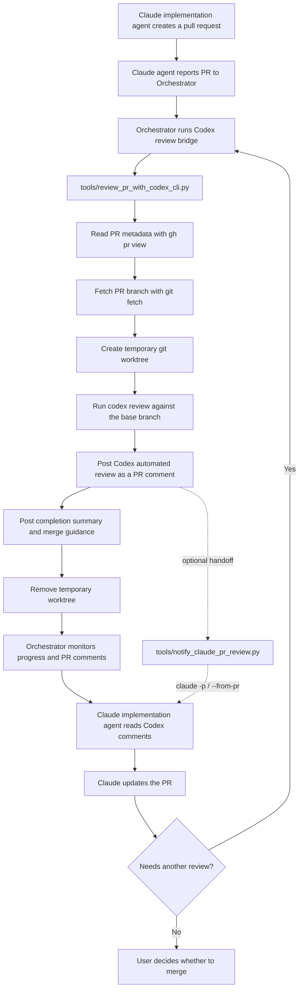

# Pull Request Review Flow

This document describes the current Claude Orchestrator -> Codex pull request
review flow.

Web version: [`pr-review-flow.html`](pr-review-flow.html).

## Collaboration Principle

Codex is the reviewer, not a subordinate of Claude. Claude implementation
agents own implementation work on the pull request. The Claude Orchestrator owns
the queue and handoffs. Codex owns independent review judgment. When they
disagree, both agents should try to converge on a practical agreement based on
evidence from the code, tests, project constraints, and user intent.

If no agreement is possible, the user is the final decision maker. The preferred
handoff is a concise summary of the disagreement, the risks of each option, and
the recommended next step.

## Discussion Logging

The GitHub pull request conversation is the canonical discussion log. Codex
review findings, Claude responses, disagreements, decisions, and follow-up
actions should be recorded as PR comments whenever they affect the outcome of
the review.

The local bridge scripts also write execution logs to `.pr-review-logs/` by
default, update `.pr-review-logs/dashboard.md` as the operator-facing status
dashboard, and maintain per-PR discussion-summary notes when Claude responds.
These local logs are ignored by git and are meant for traceability while the
workflow is running. They do not replace the GitHub PR conversation.

## Location

This flow lives in `docs/pr-review-flow.md` because it is operational project
documentation. It should become an ADR only if the team decides to make this
review automation an architectural/project governance decision.

## Flow



## Responsibilities

| Step | Owner | Files or commands |
|---|---|---|
| Create the PR | Claude implementation agent | GitHub pull request |
| Report PR ready for review | Claude implementation agent | Orchestrator queue/status |
| Trigger the review | Claude Orchestrator | `python3 tools/review_pr_with_codex_cli.py <PR_NUMBER>` |
| Read PR metadata | Codex review bridge | `gh pr view` |
| Fetch PR code | Codex review bridge | `git fetch origin <base> pull/<PR>/head:refs/remotes/origin/pr-<PR>` |
| Isolate review checkout | Codex review bridge | temporary worktree under `/private/tmp/codex-pr-*` |
| Run review | Codex CLI | `codex review --base origin/<base>` |
| Publish review | Codex review bridge | `gh pr comment` |
| Announce completion | Codex review bridge | PR comment with discussion summary and merge guidance |
| Clean up | Codex review bridge | `git worktree remove --force` |
| Monitor progress | Claude Orchestrator, User | terminal output and GitHub PR comments |
| Address findings | Claude implementation agent | PR branch |
| Notify Claude explicitly, if needed | Codex/bridge | `python3 tools/notify_claude_pr_review.py <PR_NUMBER> --from-pr` |
| Record discussion | Claude, Codex, User | GitHub PR comments; local execution logs in `.pr-review-logs/` |

## Scripts

| File | Purpose |
|---|---|
| `tools/review_pr_with_codex_cli.py` | Main entry point. The Orchestrator calls this script to start a Codex CLI review for a PR and post the result back to GitHub. |
| `tools/notify_claude_pr_review.py` | Optional reverse handoff. It tells Claude Code that Codex reviewed a PR and includes review context. |

## Orchestrator Contract

The Orchestrator is the queue manager. It does not review the code itself and it
should not summarize Codex findings as a replacement for the GitHub PR comment.
Its job is to move PRs through the loop:

1. Receive a PR number from a Claude implementation agent.
2. Run Codex review:
   `python3 tools/review_pr_with_codex_cli.py <PR_NUMBER> --notify-claude --notify-from-pr`
3. Wait for Claude to push fixes to the same PR branch.
4. Re-run Codex review after each fix commit.
5. Stop only when Codex reports no blocking findings or the user explicitly
   accepts the remaining risk.

If the Orchestrator cannot invoke Claude directly, it can ask the bridge to post
a GitHub ping as well:

```sh
python3 tools/review_pr_with_codex_cli.py <PR_NUMBER> \
  --notify-claude \
  --notify-from-pr \
  --notify-github-ping
```

## Logs

| Log | Purpose | Versioned? |
|---|---|---|
| GitHub PR comments | Canonical discussion and decision history | Yes, in GitHub |
| `.pr-review-logs/pr-<number>.md` | Local execution trace for bridge scripts | No, ignored by git |
| `.pr-review-logs/dashboard.md` | Operator-facing current review status | No, ignored by git |
| `.pr-review-logs/pr-<number>-discussion-summary.md` | Local running summary source for Claude/Codex discussion | No, ignored by git |

## Notifications

The review bridge notifies the operator through terminal output and the local
dashboard:

1. Terminal output prints when the review starts, when comments are posted, and
   when the review finishes.
2. `.pr-review-logs/dashboard.md` is updated with `RUNNING`, `COMPLETED`, or
   `FAILED` status.

The review bridge also posts lifecycle comments to the pull request for audit
history:

1. `Codex review started` when the review begins.
2. `Codex review completed` when the review ends, including a short summary for
   the user's merge decision.

The completion comment and the local dashboard include:

1. What was done during the review cycle.
2. A discussion summary with the review outcome, main discussion points, and
   pending decision.
3. Merge guidance for the user.

The completion summary is advisory. The user remains responsible for the final
merge/no-merge decision.

## Current Limitation

The Orchestrator still needs to run the review bridge after a Claude
implementation agent opens or updates a PR. A future GitHub Action could remove
that requirement by triggering the review on
`pull_request: opened`, `synchronize`, and `reopened`.
